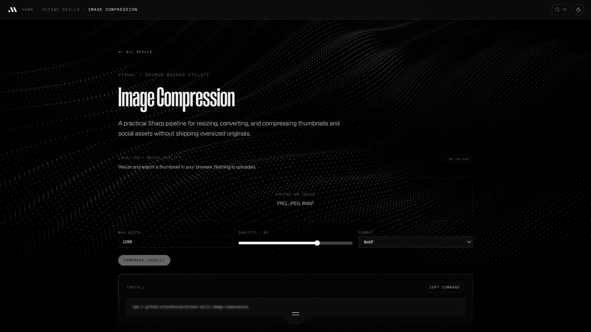
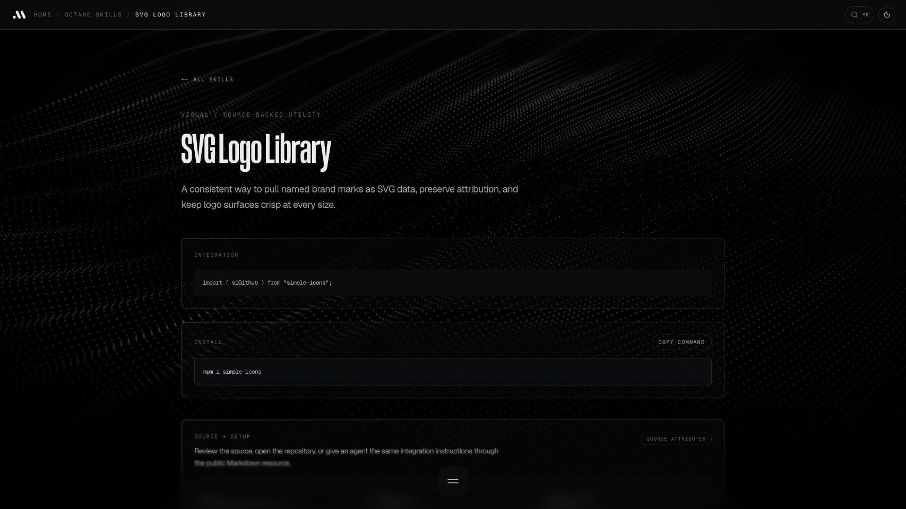

# Existing public examples

Captured September 18, 2026 from Marcus's public skills site. These are reference previews of existing Octane tools, not newly implemented new demos or proof of every interaction. Source marks and components retain their respective rights.

## Shader Gradient

[Skill](agent-skills/development/mf-visual-shader-gradient/SKILL.md) · [Interactive page](https://marcusmfrancis.com/skills/shader-gradient)

Preview withheld: the current public page rendered the shader outside its preview frame during inspection. The source workflow is available; no screenshot is presented as a successful shader demo.

## Image Compression

[Skill](agent-skills/media/mf-media-image-compression/SKILL.md) · [Interactive page](https://marcusmfrancis.com/skills/image-compression)

## SVG Logos

[Skill](agent-skills/design/mf-brand-svg-logos/SKILL.md) · [Existing page](https://marcusmfrancis.com/skills/svg-logo-library)

## Recent UI workflows

The reference-catalog and component-routing skills are written workflows. Private source recordings and workspace catalog screenshots are deliberately excluded from this public library.
